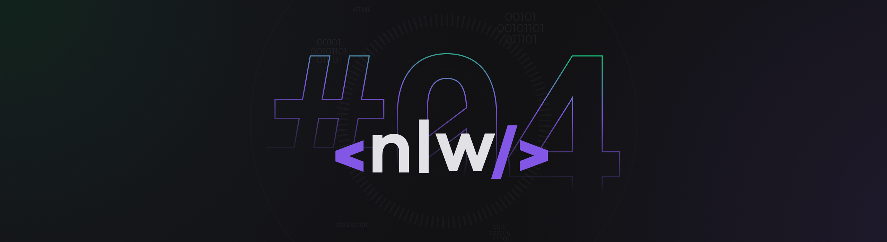

# Diego Vieira

Love learning new technologies and helping people using programming.
I'm a FullStack Developer :computer:

 :rocket:  &nbsp; I'm working at [**Tagview**](https://www.tagview.com.br/)
   :computer: &nbsp; My stack: Ruby on Rails, ReactJS & Typescript
   💬  &nbsp; About me: I like technologies, games, animes & shows from Netflix and other streaming sites
   :email: &nbsp; Get in touch with me:  

 

See my repositories :point_down:
